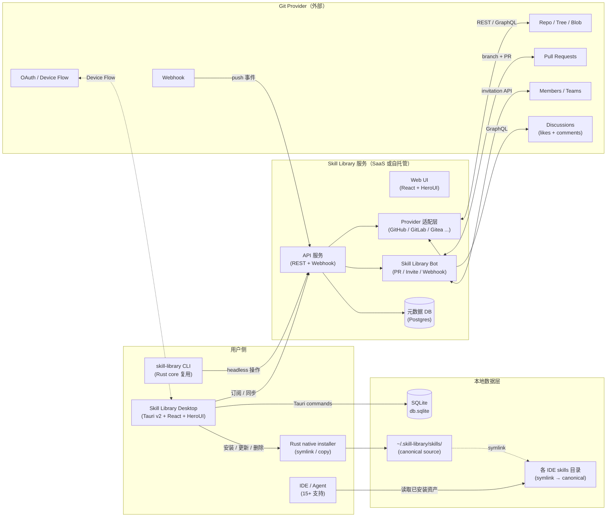

# Skill Library 系统架构

> 本文档描述 Skill Library 的系统组成、关键流程、部署形态与安全边界，配合 `PRODUCT_DOCUMENT.md` 阅读。
> 设计目标：**最薄的体验层 + 最厚的 Provider 复用** —— 资产内容尽量不流经我们的服务器。

---

## 1. 总体组件架构

### 1.1 组件图



### 1.2 解读

- **桌面端是主入口**：Tauri v2 + React + HeroUI，所有核心操作通过 Tauri commands 调用 Rust 后端。
- **SQLite 是本地真相源**：skills 注册表、targets 启用状态、缓存数据全部存在 `~/.skill-library/db.sqlite`。
- **Symlink 架构**：canonical skill 文件存在 `~/.skill-library/skills/`，各 IDE 目录通过 symlink 引用，更新只改一处。
- **Provider 适配层可插拔**：第一版 GitHub（REST + GraphQL），后续可加 GitLab / Gitea。
- **Bot 只执行已授权操作**：创建 PR、auto-merge、邀请成员前必须先校验发起人在 Provider 里的真实权限。

---

## 2. 本地数据架构

### 2.1 目录结构

```
~/.skill-library/
├── db.sqlite                    ← SQLite 数据库（WAL 模式）
├── skills/                      ← canonical skill 文件（单一数据源）
│   ├── code-reviewer/
│   │   ├── SKILL.md
│   │   ├── manifest.yaml
│   │   ├── reference/
│   │   └── scripts/
│   └── find-skills/
│       └── SKILL.md
├── credentials/                 ← OS keychain 元数据
└── logs/                        ← 日志文件
```

### 2.2 SQLite Schema

```sql
-- 已安装的 skills（canonical source of truth）
CREATE TABLE skills (
    id TEXT PRIMARY KEY,
    name TEXT NOT NULL,
    description TEXT DEFAULT '',
    version TEXT DEFAULT '0.1.0',
    source_workspace TEXT DEFAULT '',     -- e.g. "emojiiii/awesome-skills"
    source_path TEXT DEFAULT '',          -- e.g. "skills/dota2-arcade/abilities-items"
    source_branch TEXT DEFAULT '',        -- 订阅的分支
    local_path TEXT NOT NULL,             -- ~/.skill-library/skills/{id}/
    link_mode TEXT DEFAULT 'symlink',     -- 'symlink' | 'copy'
    baseline_hash TEXT DEFAULT '',        -- 导入/发布时的内容 hash
    published_hash TEXT DEFAULT '',       -- 最后发布时的 hash
    mtime_fingerprint TEXT DEFAULT '',    -- 快速变更预检
    is_modified INTEGER DEFAULT 0,        -- 本地是否有未发布的修改
    installed_at TEXT NOT NULL,
    updated_at TEXT NOT NULL
);

-- 每个 skill 在各 runtime 的启用状态
CREATE TABLE skill_targets (
    skill_id TEXT NOT NULL REFERENCES skills(id) ON DELETE CASCADE,
    runtime TEXT NOT NULL,                -- 'claude-code' | 'cursor' | 'gemini-cli' | ...
    enabled INTEGER DEFAULT 1,
    target_path TEXT DEFAULT '',          -- 实际 symlink/copy 路径
    PRIMARY KEY (skill_id, runtime)
);

-- 订阅信息
CREATE TABLE subscriptions (
    id INTEGER PRIMARY KEY AUTOINCREMENT,
    workspace TEXT NOT NULL,
    skill_id TEXT NOT NULL,
    branch TEXT DEFAULT '',               -- 订阅的分支
    channel TEXT DEFAULT 'stable',
    version TEXT DEFAULT '',
    update_policy TEXT DEFAULT 'manual',
    subscribed_at TEXT NOT NULL
);

-- 缓存（文件树、文件内容、workspace 元数据）
CREATE TABLE cache_entries (
    key TEXT PRIMARY KEY,
    workspace TEXT NOT NULL,
    data BLOB,
    fetched_at INTEGER NOT NULL
);
```

### 2.3 Symlink 架构

```
导入/安装时：
  源文件 → COPY → ~/.skill-library/skills/{id}/

启用到 IDE 时：
  ~/.skill-library/skills/{id}/ → SYMLINK → ~/.claude/skills/{id}
                                         → ~/.cursor/skills/{id}
                                         → ~/.gemini/skills/{id}
                                         → ...

用户通过 IDE 编辑 skill：
  IDE 编辑 → 通过 symlink 直接修改 canonical 文件
  → 下次检测时 mtime 变化 → 计算 hash → 标记 is_modified
```

---

## 3. 支持的 IDE / Agent Runtime

| Agent | CLI ID | Global Path |
|-------|--------|-------------|
| Claude Code | `claude-code` | `~/.claude/skills/` |
| Cursor | `cursor` | `~/.cursor/skills/` |
| Codex | `codex` | `~/.codex/skills/` |
| Gemini CLI | `gemini-cli` | `~/.gemini/skills/` |
| GitHub Copilot | `github-copilot` | `~/.copilot/skills/` |
| Windsurf | `windsurf` | `~/.codeium/windsurf/skills/` |
| OpenCode | `opencode` | `~/.config/opencode/skills/` |
| Kiro CLI | `kiro-cli` | `~/.kiro/skills/` |
| Roo Code | `roo` | `~/.roo/skills/` |
| Continue | `continue` | `~/.continue/skills/` |
| Hermes Agent | `hermes-agent` | `~/.hermes/skills/` |
| Trae | `trae` | `~/.trae/skills/` |
| Cline | `cline` | `~/.agents/skills/` |
| Goose | `goose` | `~/.config/goose/skills/` |
| Devin | `devin` | `~/.config/devin/skills/` |

> 参考：[vercel-labs/skills](https://github.com/vercel-labs/skills) 支持 50+ agent，我们优先覆盖主流 15 个。

---

## 4. 变更检测与同步

### 4.1 本地变更检测（mtime 预检 + hash）

```
App 获得焦点 / 定时检测
  │
  ├─ 遍历所有 managed skills
  │   ├─ 收集 mtime fingerprint（stat 系统调用，纳秒级）
  │   ├─ 和 SQLite 中存储的 mtime_fingerprint 对比
  │   ├─ 相同 → 跳过（99% 的情况）
  │   └─ 不同 → 计算完整 SHA-256 hash
  │       ├─ hash == baseline_hash → 误报（文件被 touch 但内容没变）
  │       └─ hash != baseline_hash → 标记 is_modified = true
  │
  └─ UI 显示"已修改"徽章
```

### 4.2 远程变更检测（SHA 轮询 + 增量 diff）

```
定时轮询（自适应退避：2min → 5min → 10min → 30min 后台）
  │
  ├─ check_workspace_head → 获取 HEAD SHA（1 次 API 调用）
  │   ├─ SHA 没变 → 什么都不做，退避 +1
  │   └─ SHA 变了 → diff_workspace_since（1 次 API 调用）
  │       └─ 得到变更的 skill paths
  │           ├─ 清除 SQLite 中对应的缓存
  │           ├─ invalidate React Query 缓存
  │           └─ UI 自动 refetch 变更的 skill
  │
  └─ 更新 SQLite 中的 HEAD SHA
```

### 4.3 发布流程

```
用户点击"发布" → 检测 is_modified
  │
  ├─ 弹出版本选择（patch / minor / major）
  ├─ 自动 bump version（0.1.0 → 0.1.1 / 0.2.0 / 1.0.0）
  ├─ 更新 manifest.yaml 中的 version 字段
  ├─ 创建 PR 到 workspace（指定分支）
  └─ 成功后：mark_published() → 重置 hash，清除修改标记
```

### 4.4 订阅更新流程

```
远程 workspace 有新版本（通过 SHA 轮询检测到）
  │
  ├─ 下载新版本文件到 ~/.skill-library/skills/{id}/（覆盖）
  ├─ mark_updated_from_remote() → 重置 hash + mtime
  └─ symlink 不变，所有 IDE 自动看到新内容
```

---

## 5. 桌面端技术栈

### 5.1 前端

| 层 | 技术 |
|---|---|
| 框架 | React 19 + TypeScript |
| UI 组件库 | HeroUI v3 |
| 样式 | Tailwind CSS v4 + CSS 变量 |
| 路由 | TanStack Router |
| 数据获取 | TanStack React Query（staleTime + gcTime） |
| 代码编辑器 | CodeMirror 6（10+ 语言语法高亮） |
| Markdown 编辑 | MDXEditor |
| 状态管理 | Zustand + React Query |
| 主题 | 暗色/亮色/跟随系统 + 4 种重点色 |

### 5.2 后端（Tauri Rust）

| 层 | 技术 |
|---|---|
| 框架 | Tauri v2 |
| 数据库 | SQLite（rusqlite，bundled，WAL 模式） |
| HTTP 客户端 | reqwest（rustls） |
| 序列化 | serde + serde_json + serde_yaml |
| 哈希 | sha2（SHA-256） |
| 日志 | tracing + tracing-appender |
| 密钥存储 | OS keychain（keyring crate） |

### 5.3 Rust Crates 结构

```
crates/
├── skill-library-core/           ← 路径解析、凭证管理、通用类型
├── skill-library-manifest/       ← SKILL.md / manifest.yaml 解析、风险评估
├── skill-library-installer/      ← install / remove / list 到各 runtime
├── skill-library-provider/       ← Provider trait 定义
├── skill-library-provider-github/ ← GitHub REST + GraphQL 实现
├── skill-library-publish/        ← 打包、policy 评估、PR 生成
└── skill-library-sync/           ← 订阅、workspace 管理、同步逻辑

apps/desktop/src-tauri/
├── src/lib.rs             ← Tauri commands（50+ 命令）
├── src/db.rs              ← SQLite 数据库模块
└── src/main.rs            ← 入口
```

---

## 6. GitHub 集成

### 6.1 认证

- **Device Flow**：桌面端使用 GitHub Device Flow（不需要 redirect URI）
- **Token 存储**：OS keychain（macOS Keychain / Windows Credential Manager / Linux Secret Service）
- **Scope**：`repo` + `read:org` + `read:user`

### 6.2 REST API 使用

| 功能 | API |
|---|---|
| 仓库信息 | `GET /repos/{owner}/{repo}` |
| 文件树 | `GET /repos/{owner}/{repo}/git/trees/{sha}?recursive=1` |
| 文件内容 | `GET /repos/{owner}/{repo}/contents/{path}?ref={ref}` |
| 分支列表 | `GET /repos/{owner}/{repo}/branches` |
| Commit 历史 | `GET /repos/{owner}/{repo}/commits?path={path}` |
| Compare | `GET /repos/{owner}/{repo}/compare/{base}...{head}` |
| 成员列表 | `GET /repos/{owner}/{repo}/collaborators` |
| 邀请 | `PUT /repos/{owner}/{repo}/collaborators/{username}` |
| PR 创建 | `POST /repos/{owner}/{repo}/pulls` |

### 6.3 GraphQL API 使用

| 功能 | 用途 |
|---|---|
| Discussions 列表 | 获取 skill 的点赞数和评论数 |
| Discussion 评论 | 获取/发表评论 |
| 点赞 | `addUpvoteToDiscussion` mutation |
| 发表评论 | `addDiscussionComment` mutation |

### 6.4 Discussions 集成

- 每个 skill 对应一个 Discussion（标题格式：`[skill] {skill-id}`）
- 点赞 = Discussion upvote
- 评论 = Discussion comment
- 未开启 Discussions → 优雅降级，提供开启引导链接

---

## 7. 缓存策略

### 7.1 三层缓存

| 层 | 存储 | TTL | 用途 |
|---|---|---|---|
| React Query 内存 | 进程内存 | staleTime: 2-5min, gcTime: 30min | 组件间共享，避免重复请求 |
| SQLite cache_entries | 磁盘 | 按 workspace 管理，手动清理 | 文件树、文件内容持久化 |
| Workspace HEAD SHA | SQLite skills 表 | 轮询更新 | 变更检测基准 |

### 7.2 缓存失效

- **SHA 变化**：远程 HEAD 变了 → 精确清除变更 skill 的缓存
- **手动刷新**：用户点击刷新按钮 → invalidate 对应查询
- **设置清理**：设置 → 缓存 → 按 workspace 查看大小 → 一键清除

---

## 8. 安全边界

### 8.1 数据分类

| 数据 | 存储位置 | 加密 |
|---|---|---|
| GitHub OAuth Token | OS Keychain | 系统级加密 |
| Skill 文件内容 | `~/.skill-library/skills/` | 无（本地文件） |
| 用户设置 | localStorage | 无（非敏感） |
| 缓存数据 | SQLite | 无（可重建） |
| 日志 | `~/.skill-library/logs/` | Token 自动脱敏 |

### 8.2 权限模型

- **完全继承 Git Provider**：用户能看到什么 = GitHub 上能看到什么
- **Bot 不提升权限**：每次操作前用发起人的 token 实时校验
- **高风险权限提示**：`shell.execute`、`network.external`、`filesystem.write` 安装前高亮警告

---

## 9. 部署模式

### 9.1 桌面端（当前主形态）

- Tauri v2 打包为 macOS .dmg / Windows .msi / Linux .AppImage
- 所有数据本地存储（SQLite + 文件系统）
- 直连 GitHub API，不需要中间服务器
- 适合个人开发者和小团队

### 9.2 SaaS（未来）

- Web UI + API 服务 + Webhook 接收
- 适合大团队、需要集中管理订阅和统计

### 9.3 自托管（未来）

- Docker Compose 一键部署
- 适合企业内网、自建 GitLab / Gitea

---

## 10. 与产品文档的对齐

### 10.1 已实现（桌面端 MVP）

- ✅ GitHub Device Flow 登录
- ✅ Workspace 浏览与管理
- ✅ Skill 列表 + 文件树 + 内容查看/编辑
- ✅ 版本历史（commit timeline）
- ✅ 分支切换
- ✅ 订阅 + 安装到 15+ IDE
- ✅ 本地 Skill 发布到团队 Workspace（PR）
- ✅ 邀请成员 + 权限修改
- ✅ 高风险权限提示
- ✅ 暗色主题 + 重点色
- ✅ SQLite 本地数据管理
- ✅ Symlink 架构（开关即 link/unlink）
- ✅ mtime + hash 变更检测
- ✅ SHA 轮询远程变更检测
- ✅ GitHub Discussions 集成（点赞 + 评论）
- ✅ CodeMirror 多语言编辑器
- ✅ 从 IDE 导入未托管 skill
- ✅ 取消托管（还原为独立文件）

### 10.2 待实现

- ⬜ 版本对比（语义 diff 视图）
- ⬜ 订阅自动更新（webhook 触发）
- ⬜ 管理员 Dashboard（统计面板）
- ⬜ 团队级订阅文件
- ⬜ CLI 完整命令集
- ⬜ 多 Provider（GitLab / Gitea）
- ⬜ 公开市场 / 搜索发现
