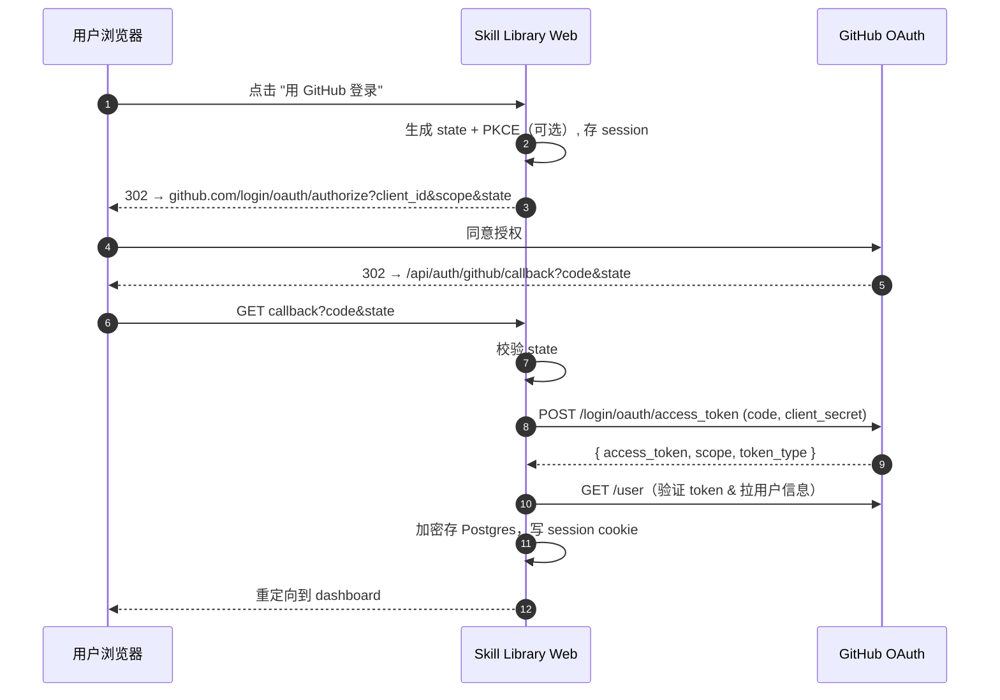
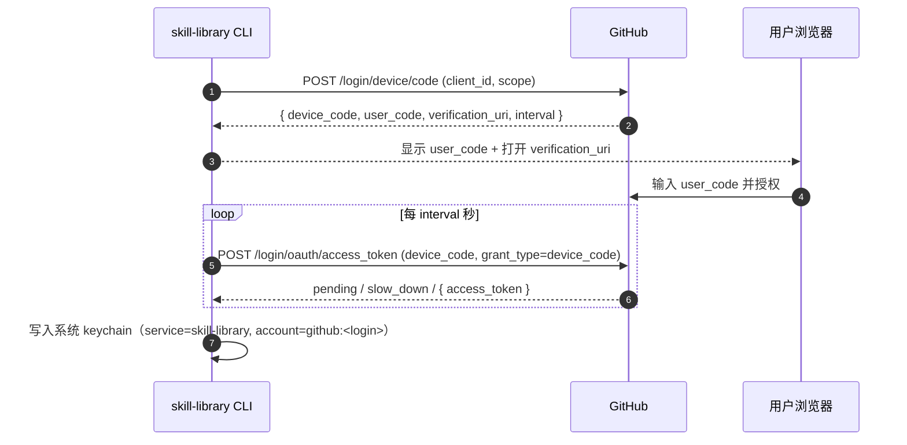

# Provider 接口与 GitHub 实现技术 Spike

> 状态：Spike 草稿
> 范围：MVP 第一版 Provider 抽象 + GitHub 实现
> 关联文档：PRODUCT_DOCUMENT.md 第 6 / 9 / 13 节

## 1. 目标与原则

1. **接口先行，实现后置**：先冻结 Provider 接口，GitHub 只是第一个实现，避免接口被 GitHub 细节带偏。
2. **能力降级而非抛错**：Provider 不支持的能力（如 webhook）由适配层用轮询兜底，上层逻辑无感知。
3. **内容不落库**：仓库内容（Skill 文件）不缓存到我们的服务器，只缓存元数据 + ETag，权责留在 Provider 侧。
4. **权限实时校验**：不复制权限模型，每次敏感操作通过 Provider API 验证当前用户是否仍有权限。
5. **多租户 quota 隔离**：API 调用以"用户 token"为最小配额单元，避免一个噪声用户耗尽全局 rate limit。
6. **用户身份与 Bot 身份分离**：用户 token 用来证明"谁有权限"，Bot / GitHub App token 只用来执行已授权的 PR、webhook、邀请操作，不能提升用户权限。

## 2. Provider 接口定义

```typescript
// Provider 是 Skill Library 与具体 Git 托管平台之间的唯一抽象边界。
// 所有方法都是 async；调用方不应假设任何 Provider 特定字段存在。

export interface Provider {
  readonly id: 'github' | 'gitlab' | 'gitea' | 'bitbucket' | string;
  readonly capabilities: ProviderCapabilities;

  // ---- 工作空间（=repo） ----
  /** 列出当前 token 可访问的 workspace；支持分页与按 org 过滤 */
  listWorkspaces(opts?: ListWorkspacesOpts): Promise<Page<Workspace>>;
  /** 读取单个 workspace 元数据（含默认分支、可见性、当前用户角色） */
  getWorkspace(ref: WorkspaceRef): Promise<Workspace>;

  // ---- 文件 ----
  /** 列出指定 ref 下的文件树；可指定 path 前缀；大仓库走分页或递归 false */
  listFiles(ref: WorkspaceRef, at: GitRef, opts?: ListFilesOpts): Promise<FileEntry[]>;
  /** 读取单个文件内容；返回 raw bytes + sha + 编码标记 */
  readFile(ref: WorkspaceRef, at: GitRef, path: string): Promise<FileBlob>;

  // ---- 版本 ----
  /** 列出 git tag（仅 tag 名 + commit sha + 创建时间） */
  listTags(ref: WorkspaceRef, opts?: PageOpts): Promise<Page<Tag>>;
  /** 列出 release（含 prerelease 标志、assets 列表） */
  listReleases(ref: WorkspaceRef, opts?: PageOpts): Promise<Page<Release>>;
  /** 取单个 release 详情（含 body / changelog） */
  getRelease(ref: WorkspaceRef, releaseId: string): Promise<Release>;
  /** 流式下载 release asset 或 source tarball；返回可读流 + content-type */
  downloadReleaseAsset(ref: WorkspaceRef, assetRef: ReleaseAssetRef): Promise<AssetStream>;

  // ---- 历史 ----
  /** 按分支/tag 列 commit；用于"最近活动"和增量同步 */
  listCommits(ref: WorkspaceRef, opts: ListCommitsOpts): Promise<Page<Commit>>;
  /** 比较两个 ref，返回 commits + files diff（粗粒度，详细 diff 由前端按需取） */
  compareRefs(ref: WorkspaceRef, base: GitRef, head: GitRef): Promise<RefComparison>;

  // ---- 成员 ----
  /** 列出 workspace 成员（含角色 admin/write/read） */
  listMembers(ref: WorkspaceRef, opts?: PageOpts): Promise<Page<Member>>;
  /** 实时校验当前 token 用户对该 workspace 的权限 */
  checkPermission(ref: WorkspaceRef, login: string): Promise<PermissionLevel>;
  /** 查询当前用户是否可邀请成员；不同 Provider 映射到 repo admin / org owner / team maintainer */
  checkInvitePermission(ref: WorkspaceRef, login: string, target?: InviteTarget): Promise<boolean>;
  /** 创建 repo collaborator 或 org/team invitation */
  createInvitation(ref: WorkspaceRef, invite: InvitationInput): Promise<Invitation>;
  /** 查询 pending / accepted invitation */
  getInvitation(ref: WorkspaceRef, invitationId: string): Promise<Invitation>;

  // ---- PR / 发布 ----
  /** Bot 创建分支、提交文件、打开 PR；调用前上层必须已校验发起人 write 权限 */
  createPullRequest(ref: WorkspaceRef, input: PullRequestInput): Promise<PullRequest>;
  /** Bot 合并 PR；调用前上层必须已通过 policy 且发起人有足够权限 */
  mergePullRequest(ref: WorkspaceRef, pr: PullRequestRef): Promise<PullRequest>;

  // ---- Webhook ----
  /** 注册 push 事件 webhook，返回 provider 侧的 hook id；secret 由我方生成 */
  registerWebhook(ref: WorkspaceRef, cfg: WebhookConfig): Promise<WebhookHandle>;
  /** 注销 webhook（卸载或 token 失效时调用） */
  unregisterWebhook(ref: WorkspaceRef, handle: WebhookHandle): Promise<void>;
  /** 校验入站 webhook 的签名，返回 parsed 事件或抛 InvalidSignature */
  verifyWebhookSignature(headers: Record<string, string>, body: Buffer, secret: string): WebhookEvent;

  // ---- 认证 ----
  /** 启动 OAuth：返回授权 URL + state；CLI 走 device flow 时返回 user_code */
  startOAuth(opts: OAuthStartOpts): Promise<OAuthStart>;
  /** 完成 OAuth：用 code/device_code 换 token */
  completeOAuth(opts: OAuthCompleteOpts): Promise<TokenSet>;
  /** 刷新 token（GitHub OAuth App 默认无 refresh_token，GitHub App 有） */
  refreshToken(token: TokenSet): Promise<TokenSet>;
  /** 撤销 token（用户登出 / 设备解绑时调用） */
  revokeToken(token: TokenSet): Promise<void>;
}

// 关键类型片段
export interface WorkspaceRef { owner: string; name: string; }
export type GitRef = { kind: 'branch' | 'tag' | 'sha'; value: string };
export type PermissionLevel = 'admin' | 'maintain' | 'write' | 'triage' | 'read' | 'none';
export interface ProviderCapabilities {
  webhook: boolean;
  releaseAssets: boolean;
  graphql: boolean;
  deviceFlow: boolean;
  refreshToken: boolean;
  botIdentity: boolean;
  pullRequests: boolean;
  invitations: boolean;
}
export interface FileBlob { path: string; sha: string; bytes: Uint8Array; encoding: 'utf-8' | 'base64'; etag?: string; }
export interface WebhookConfig { events: ('push' | 'release')[]; callbackUrl: string; secret: string; }
export interface TokenSet { accessToken: string; refreshToken?: string; expiresAt?: number; scopes: string[]; }
export type InviteTarget = { kind: 'repo-collaborator' } | { kind: 'org-team'; org: string; teamSlug?: string };
export interface InvitationInput { loginOrEmail: string; role: 'read' | 'triage' | 'write' | 'maintain' | 'admin'; target?: InviteTarget; }
export interface PullRequestInput { branchName: string; title: string; body: string; files: Array<{ path: string; bytes: Uint8Array; mode?: string }>; base?: string; }
```

## 3. 错误模型

所有 Provider 方法只抛 `ProviderError`，由适配层把 HTTP 状态/错误体统一映射。上层用 discriminated union 精确分支处理。

```typescript
export type ProviderError =
  | { kind: 'NotFound'; resource: string; ref?: string }
  | { kind: 'Forbidden'; resource: string; reason?: string }            // 有 token 但无权限
  | { kind: 'Unauthorized'; reason: 'token_invalid' | 'token_expired' | 'scope_missing'; missingScopes?: string[] }
  | { kind: 'RateLimited'; retryAfterMs: number; bucket: 'core' | 'graphql' | 'search' | 'secondary' }
  | { kind: 'NetworkError'; cause: string; retriable: true }
  | { kind: 'ProviderUnavailable'; status?: number; message: string }   // 5xx / 502 / 503
  | { kind: 'Conflict'; resource: string; hint?: string };              // 例如 webhook 已存在

export class ProviderErrorBox extends Error {
  constructor(public readonly detail: ProviderError) { super(`${detail.kind}`); }
}
```

映射约定（GitHub）：

| HTTP / 信号 | 映射 |
|---|---|
| 404 | `NotFound` |
| 401 | `Unauthorized{token_invalid \| token_expired}` |
| 403 + `X-RateLimit-Remaining: 0` | `RateLimited{core}` |
| 403 + `Retry-After` | `RateLimited{secondary}` |
| 403（其他） | `Forbidden` |
| 422 webhook 已存在 | `Conflict` |
| 5xx / fetch error | `ProviderUnavailable` / `NetworkError` |

## 4. GitHub 登录与 App/Bot 权限

### 4.1 身份模型

- **用户登录**：Web 可先用 OAuth App 跑通；CLI 走 Device Flow 或 PAT 兜底。用户 token 用于读取用户身份、列 repo、实时权限校验。
- **团队 Bot**：PR 创建、webhook 注册、成员邀请优先用 GitHub App installation token。GitHub App 可按 org/repo 安装，权限粒度更细，也更适合企业客户。
- **硬规则**：Bot 执行动作前，上层必须先用发起人的 Provider 身份确认权限。Bot token 不能成为权限绕过通道。

### 4.2 OAuth App 配置

- **Callback URL**：`https://<host>/api/auth/github/callback`（Web）+ `http://127.0.0.1:<random>/cb`（CLI 本地回环兜底）。
- **Scopes（最小集）**：
  - `repo`：读私有仓库内容（MVP 必需，因为 Skill 仓库可能私有）
  - `read:org`：读组织成员关系，用于权限校验
  - `read:user`：读用户基本资料
  - 不申请 `write:*`；发布和邀请由 GitHub App Bot 在完成用户权限校验后执行。

### 4.3 GitHub App 权限（待 spike 确认）

MVP 需要验证的 GitHub App 权限组合：

| 能力 | 可能需要的 GitHub App 权限 |
|---|---|
| 读取 repo tree / blob / tag | Contents: read |
| 创建 publish branch / commit | Contents: write |
| 创建 PR / comment / status | Pull requests: write |
| 注册 webhook | Metadata: read + repository webhooks delivery（具体权限 spike 确认） |
| 邀请 repo collaborator | Administration: write |
| 邀请 org member / 加 team | Members: write（organization permission） |

若用户未安装 GitHub App 或未授予对应权限，Skill Library 只展示引导，不尝试用用户 OAuth token 绕过。

### 4.4 Web OAuth Code Flow



### 4.5 CLI Device Flow



### 4.6 Token 存储

- **Web**：Postgres 表 `provider_tokens(user_id, provider, encrypted_token, scopes, created_at)`，列加密用 KMS 派生的 DEK（envelope encryption）。session cookie 仅放 user_id，不放 token。
- **Bot**：GitHub App private key / installation token 单独存储，installation token 短期缓存，按 org/repo 维度隔离。
- **CLI**：系统 keychain（macOS Keychain / Windows Credential Manager / libsecret）。无 keychain 时回退到 `~/.skill-library/credentials.json`，文件权限 0600，并提示用户。
- **绝不写日志**：token、code、device_code 都加入 logger redact 列表。

### 4.7 刷新与撤销

- OAuth App token 默认无过期；定期（如每小时）调用 `GET /user` 探活，401 → 标记失效并提示重登。
- GitHub App 走 refresh token 时，`expiresAt - 5min` 主动刷新，并发刷新用 mutex 防多次换发。
- 登出 / 撤销设备：调用 `DELETE /applications/{client_id}/grant`（撤销整个授权）或 `/token`（仅撤销当前 token），随后从存储删除。

## 5. GitHub API 调用方案

| Method | Path | 用途 | Scope |
|---|---|---|---|
| GET | `/user` | 拉当前登录用户、token 探活 | `read:user` |
| GET | `/user/repos` | 列出当前用户可访问的 repos（含私有） | `repo` |
| GET | `/orgs/{org}/repos` | 列出某组织的 repos | `read:org` + `repo` |
| GET | `/repos/{owner}/{repo}` | 读 workspace 元数据（默认分支、可见性） | `repo` |
| GET | `/repos/{owner}/{repo}/contents/{path}` | 读单文件 / 列目录（小目录） | `repo` |
| GET | `/repos/{owner}/{repo}/git/trees/{sha}?recursive=1` | 一次性拉整棵树（大仓库） | `repo` |
| GET | `/repos/{owner}/{repo}/tags` | 列 tag | `repo` |
| GET | `/repos/{owner}/{repo}/releases` | 列 release（含 prerelease） | `repo` |
| GET | `/repos/{owner}/{repo}/releases/{id}` | release 详情 | `repo` |
| GET | `/repos/{owner}/{repo}/releases/assets/{id}` | release asset 元数据 | `repo` |
| GET | `/repos/{owner}/{repo}/commits` | 列 commit | `repo` |
| GET | `/repos/{owner}/{repo}/compare/{base}...{head}` | 比较两个 ref | `repo` |
| GET | `/repos/{owner}/{repo}/collaborators` | 列协作者 | `repo` |
| GET | `/repos/{owner}/{repo}/collaborators/{user}/permission` | 查某用户权限 | `repo` |
| PUT | `/repos/{owner}/{repo}/collaborators/{username}` | 邀请 repo collaborator | GitHub App `Administration: write` 或 repo admin |
| POST | `/orgs/{org}/invitations` | 创建 org invitation，可带 team_ids | GitHub App organization `Members: write` |
| PUT | `/orgs/{org}/teams/{team_slug}/memberships/{username}` | 添加 / 邀请 team member | org owner 或 team maintainer 权限 |
| POST | `/repos/{owner}/{repo}/git/refs` + contents API | 创建 publish branch / commit | GitHub App `Contents: write` |
| POST | `/repos/{owner}/{repo}/pulls` | 创建 publish PR | GitHub App `Pull requests: write` |
| PUT | `/repos/{owner}/{repo}/pulls/{pull_number}/merge` | 合并 publish PR | GitHub App `Pull requests: write` + branch policy 允许 |
| POST | `/repos/{owner}/{repo}/hooks` | 注册 webhook | `repo` (admin) |
| DELETE | `/repos/{owner}/{repo}/hooks/{id}` | 注销 webhook | `repo` (admin) |
| GET | `https://api.github.com/repos/{owner}/{repo}/tarball/{ref}` | 下载 source tarball（302 → CDN） | `repo` |

### 5.1 何时用 GraphQL

REST 取 N 个 Skill 仓库的 manifest 需要 N×（list contents + read file），GraphQL 一次请求即可批量：

- **场景**：Dashboard 加载用户订阅的所有 Skill 的最新 tag + manifest 摘要（典型 20-50 个仓库）。
- **做法**：用 `repository(owner, name) { object(expression: "v1.4.2:code-reviewer/SKILL.md") { ... on Blob { text } } }` 在一个 query 里拼多个 alias。
- **配额**：GraphQL 5000 points/h，单 query 复杂度按 node 数计算，监控 `rateLimit { remaining cost }` 字段。

REST 用于流式下载、webhook 注册、单文件预览。

## 6. 资产内容下载策略

按优先级回退：

1. **Release tarball / asset**：作者打了 release 时优先用，URL 走 `/releases/assets/{id}`（带 `Accept: application/octet-stream`），GitHub 返回 302 到 S3 CDN，CLI 直接跟随。无需经过我方服务器。
2. **Source tarball**：无 release 时，用 `/tarball/{ref}` 取 tag 或 commit 对应的源码包。
3. **单文件预览**：Web UI 渲染 `SKILL.md` 时用 `/contents/{path}?ref=`（≤1MB）或 `/git/blobs/{sha}`（任意大小，base64）。

### 6.1 缓存

- 元数据（repo、tags、releases、tree）：进程内 LRU + Redis，key 含 ref，值带 `etag` 与 `last_modified`。
- 下次请求带 `If-None-Match: <etag>` → 304 不消耗 rate limit core 配额（但仍消耗少量），命中即续期 TTL。
- TTL 默认 5min（活跃 repo）/ 1h（冷 repo），webhook 触达后立即 invalidate。
- **不缓存文件正文**到我方持久层（合规），仅短时进程内缓存（≤60s）用于一次请求复用。

## 7. Rate Limit 处理

- **Authenticated REST**：5000 req/h/user。多租户用每用户 token 隔离，单用户耗尽不影响他人。
- **GraphQL**：5000 points/h，按 query cost 计；高峰期监控 `rateLimit.remaining` 主动降速。
- **Secondary rate limit**：并发 / 短时高频触发，返回 403 + `Retry-After`，必须遵守。

退避策略：

```
on 403 / 429:
  if has Retry-After: sleep(Retry-After) then retry
  elif X-RateLimit-Reset: sleep until reset (max 15min, else 降级)
  else: 指数退避 1s, 2s, 4s, 8s（jitter ±25%），最多 5 次
```

接近上限的降级：

- core 剩余 < 10% → webhook 路径继续，主动轮询从 1h 拉长到 6h
- core 剩余 < 2% → 暂停所有非交互式后台任务，交互请求加排队提示
- 用户级 token 耗尽 → UI 显示 "GitHub 限流中，下个窗口 X 分钟后"

## 8. Webhook 设计

### 8.1 注册

- 事件：`push`（MVP 必须）+ `release`（用于打包发布触发）。
- Secret：每 repo 生成 32 字节随机串，存我方 DB（加密），不复用。
- Content-Type：`application/json`。
- 注册时若已存在同 callback 的 hook（422 Conflict） → 取回旧 id 并更新 secret。

### 8.2 签名校验

- GitHub 用 HMAC-SHA256，header `X-Hub-Signature-256: sha256=<hex>`。
- 校验：`hmac_sha256(secret, raw_body) == header`，**用 timingSafeEqual 防时序攻击**。
- 缺失 / 不匹配 → 400 + 不解析 body。

### 8.3 事件结构（push 事件关注字段）

```jsonc
{
  "ref": "refs/heads/main",          // 或 refs/tags/v1.4.2
  "before": "<sha>", "after": "<sha>",
  "repository": { "id": 1, "full_name": "acme/skills" },
  "commits": [{ "id": "<sha>", "modified": ["code-reviewer/SKILL.md"] }],
  "head_commit": { "id": "<sha>" },
  "sender": { "login": "alice" }
}
```

我方只需 `repository.full_name + ref + after + commits[].modified` 来判断哪些 Skill 受影响。

### 8.4 去重与幂等

- 每次 delivery GitHub 在 header 带 `X-GitHub-Delivery: <uuid>`。
- 入库前 `INSERT ... ON CONFLICT DO NOTHING` 到 `webhook_deliveries(delivery_id PRIMARY KEY)`，已存在直接 200 返回。
- 处理函数（"标记订阅有更新"、"广播到客户端"）必须幂等：基于 `(repo, ref, after_sha)` upsert。

### 8.5 兜底

- Webhook 不可达 / 注册失败 / Provider 不支持 → 定时轮询 `listCommits(default_branch)` 与 `listTags`，默认 10 分钟一次。
- 用 `since` 参数 + 上次最大 sha 增量比较。

## 9. 安全考虑

- **最小 scope**：用户登录 token 只申请 `repo` + `read:org` + `read:user`；写操作由 GitHub App installation token 执行。
- **Bot 不提升权限**：publish PR、auto-merge、invitation 前必须先用用户身份查 Provider 权限；权限不足直接拒绝。
- **邀请最终落 Provider**：Skill Library 可保存 invitation 状态缓存，但成员关系以 GitHub / GitLab / Gitea 为准。
- **登出即撤销**：用户主动登出或撤销设备，调用 `DELETE /applications/{client_id}/token`，**不**只删本地记录。
- **私有 repo 内容不缓存到我方持久存储**：Postgres / 对象存储里只放 manifest 元数据（name、version、permissions、targets）和 ETag，正文一律按需现拉。
- **每 repo 独立 webhook secret**：泄漏一个不影响其他 repo；secret 不出现在日志、错误响应、客户端。
- **Token 与 secret 加密**：列加密 + KMS DEK；备份介质同样加密。
- **Webhook callback 防 SSRF / 重放**：仅接受 GitHub 官方源 IP 段（`/meta` endpoint 拉取动态更新）+ 校验 delivery id 5min 内才接受。TODO: 实施时确认 是否启用 IP 白名单（自托管 GitHub Enterprise 会破坏假设）。
- **审计日志**：OAuth、token 撤销、webhook 注册/注销、权限校验失败 全部入审计表。

## 10. Spike 验证清单

| # | 风险点 | 验证方式 | 预计 |
|---|---|---|---|
| 1 | OAuth App vs GitHub App 的取舍 | 跑通用户登录 + GitHub App installation；验证列私有 repo、创建 PR、注册 webhook、邀请成员的最小权限 | 1d |
| 2 | GraphQL 批量取 manifest 的实际配额消耗 | 写脚本对 50 个仓库批取 SKILL.md，记录 cost，对比纯 REST 的请求数 | 1d |
| 3 | Release tarball 302 跟随在 CLI 端的鉴权穿透 | 用真实私有 repo 的 release，curl 走 device flow token，验证 redirect 是否需要二次 Authorization header | 0.5d |
| 4 | Webhook 端到端可达性 | 本地用 cloudflared / smee.io 接收 push，验证 secret 签名 + delivery 去重 | 1d |
| 5 | Rate limit 边界行为 | 故意打满 core，观察 secondary rate limit 触发条件与 Retry-After 准确度 | 1d |
| 6 | ETag + If-None-Match 是否真正节省配额 | 304 是否还扣 quota？跑 1000 次对比 `X-RateLimit-Used` | 0.5d |
| 7 | Token 存储跨平台一致性 | macOS / Linux / Windows CLI keychain 写读，验证回退路径与权限位 | 1d |
| 8 | 大仓库（>10k 文件）的 tree 拉取性能 | 拿一个真实大仓库测 `git/trees?recursive=1` 的延迟与是否 truncated | 0.5d |
| 9 | GitHub invitation 行为 | personal private repo collaborator、org invitation、team membership 三种路径各跑一遍，确认 pending / accepted 状态读取方式 | 1d |
| 10 | Bot publish PR 行为 | GitHub App 创建 branch + PR + check + auto-merge，验证 branch protection 下的权限边界 | 1d |

## 11. 后续 Provider 接入指引

### GitLab（含自建）

- API 路径与字段命名差异大：`projects` 替代 `repos`，`access_tokens` 替代 `collaborators`。
- Webhook：用 `X-Gitlab-Token` 明文校验（非 HMAC），需在适配层把 `verifyWebhookSignature` 改为常量时间字符串比较。
- OAuth：自建实例 issuer URL 各异，需让用户在连接时填 base URL。
- Release：有 `releases` API，但 asset 不是单独资源，结构不同。
- Device flow：OAuth 2.0 device flow 需自建实例显式开启，需检测 capability。

### Gitea / Forgejo

- API 形态接近 GitHub（刻意兼容），多数 endpoint 路径只差前缀，复用度最高。
- Webhook 默认是 HMAC-SHA256，但 header 名 `X-Gitea-Signature`，需要适配。
- 没有 GraphQL，批量取 manifest 只能 REST 多次或退到 raw clone。
- 老版本 Gitea 无 device flow，CLI 登录需走 PAT 或本地回环。

### Bitbucket

- 概念不同：`workspaces > repositories`（多了一层 workspace），需扩展 `WorkspaceRef` 或映射成 `owner = workspace_slug`。
- OAuth scope 体系完全不同（`repository`、`webhook` 等单独项），需重新映射最小 scope。
- Webhook 没有内置 secret 字段，需走 IP 白名单 + 短时一次性 token 兜底。
- `compare` API 行为略不同（按 inclusive/exclusive 边界）。
- Release：Bitbucket Cloud **没有 release 概念**，只有 tag + Downloads；要把"release"映射回 tag + 附件。

每接入一家，做法不变：实现 `Provider`，在 `capabilities` 中如实声明，把缺失的能力交给上层适配层走轮询/PAT 兜底。
