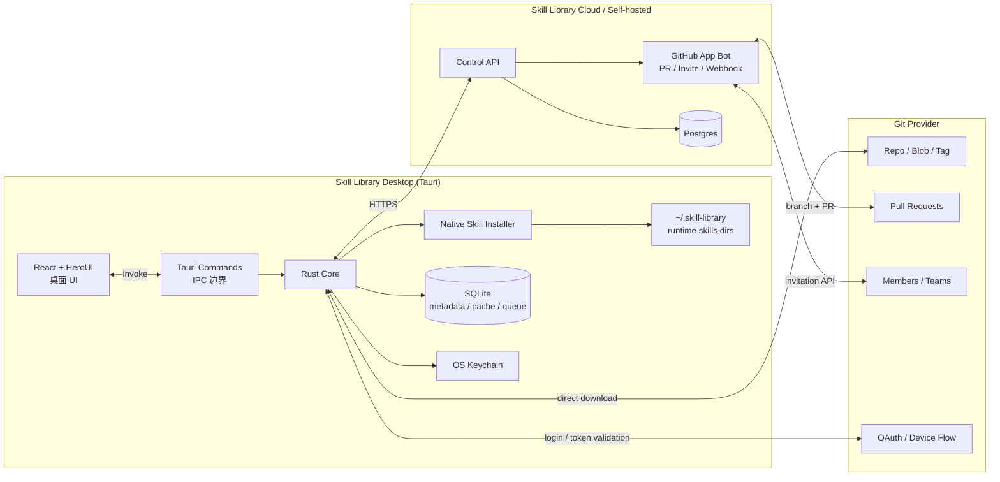

# Skill Library Tauri 技术方案

> 状态：v1 草案
> 目标技术栈：Tauri v2 + Rust + React 19 + HeroUI v3 + Tailwind CSS v4
> 关联文档：`PRODUCT_DOCUMENT.md`、`ARCHITECTURE.md`、`PROVIDER_SPIKE.md`、`SKILL_MANIFEST_SCHEMA.md`

## 1. 结论

Skill Library 的主客户端采用 **Tauri 桌面应用 + Rust 原生 core**：

- 不内置 Node / Bun。
- 不完整重写 `npx skills`。
- Rust 实现 Skill Library 需要的最小 Skill installer。
- React + HeroUI 负责本地桌面 UI。
- 云端只做 GitHub App / Bot / webhook / 元数据控制面。
- CLI 作为 Tauri Rust core 的复用入口，不另起一套 Node CLI。

这样可以保持本地应用体积小、权限清晰、企业分发友好，同时把复杂的团队能力留在 Git Provider 和云端控制面。

## 2. 架构总览



核心分工：

| 层 | 职责 |
|---|---|
| React + HeroUI | 桌面产品界面、状态展示、表单、diff/PR/邀请页面 |
| Tauri Commands | 前端到 Rust 的唯一 IPC 边界，做参数校验和错误映射 |
| Rust Core | Provider client、本地订阅、sync 决策、publish 打包、installer、lockfile |
| Local SQLite | 本地 metadata、cache index、sync queue、设备状态 |
| OS Keychain | GitHub token、device token、加密密钥 |
| Cloud API | 订阅跨设备同步、webhook 扇出、Bot 任务、邀请状态缓存 |
| GitHub App Bot | 创建 PR、auto-merge、成员邀请、webhook |

## 3. 技术选型

### 3.1 Desktop

- **Tauri**：v2。
- **Rust**：stable，edition 2021/2024 开工时定，优先 2021 保守。
- **Frontend**：React 19 + Vite + TypeScript。
- **UI**：HeroUI v3，要求 React 19+、Tailwind CSS v4。
- **Icons**：lucide-react。
- **State**：TanStack Query + Zustand。
- **Routing**：TanStack Router。
- **Forms**：react-hook-form + zod。
- **Markdown**：react-markdown + rehype-sanitize。
- **Diff**：Rust 生成 unified/semantic diff，前端用轻量 diff viewer 渲染。

HeroUI 接入规则：

```css
@import "tailwindcss";
@import "@heroui/styles";
```

主题用 HeroUI CSS variables，不做重装饰。产品是团队工具，界面应偏工作台：左侧导航、密集列表、清晰状态、少卡片、少营销式布局。

### 3.2 Rust Core

建议 crate：

| 能力 | crate |
|---|---|
| HTTP | `reqwest` + `rustls` |
| async | `tokio` |
| JSON / YAML | `serde`、`serde_json`、`serde_yaml` |
| SQLite | `sqlx` 或 `rusqlite`，MVP 推荐 `sqlx` |
| Git 操作 | 优先 GitHub REST tarball；需要 diff/commit 时用 API；本地 git fallback 用 `git2` |
| archive | `tar`、`flate2`、`zip` |
| glob | `globset` |
| semver | `semver` |
| hashing | `sha2` |
| filesystem atomic | `tempfile`、`fs_extra` 或手写原子 rename |
| keychain | `keyring` crate，Tauri plugin 只做 UI 能力时不直接暴露 |
| logging | `tracing`、`tracing-subscriber` |
| errors | `thiserror`、`anyhow` 仅在边界内使用 |

### 3.3 Tauri Plugins

MVP 推荐：

| Plugin | 用途 |
|---|---|
| `tauri-plugin-deep-link` | `skill-library://subscribe`、OAuth callback、邀请 landing |
| `tauri-plugin-single-instance` | 防止多实例；deep link 事件转发到已有窗口 |
| `tauri-plugin-updater` | 桌面客户端自更新 |
| `tauri-plugin-opener` | 打开 GitHub OAuth / PR / repo 页面 |
| `tauri-plugin-store` | 非敏感 UI preference；敏感信息进 keychain |
| `tauri-plugin-dialog` | 选择本地 Skill 目录、导入文件 |
| `tauri-plugin-fs` | 严格 capability 限制下读写必要路径 |

安全规则：

- 前端不能直接任意读写文件。
- 所有敏感文件操作走 Rust command。
- Tauri capabilities 只允许主窗口访问必要命令。
- `shell` plugin 默认不用；必须调用外部命令时在 Rust core 做白名单。

## 4. Rust Workspace 结构

建议仓库结构：

```text
skill-library/
├── apps/
│   └── desktop/
│       ├── src/                    # React + HeroUI
│       ├── src-tauri/
│       │   ├── Cargo.toml
│       │   ├── tauri.conf.json
│       │   └── src/
│       │       ├── lib.rs
│       │       ├── commands/
│       │       └── state.rs
│       └── package.json
├── crates/
│   ├── skill-library-core/
│   ├── skill-library-provider/
│   ├── skill-library-provider-github/
│   ├── skill-library-installer/
│   ├── skill-library-manifest/
│   ├── skill-library-sync/
│   ├── skill-library-publish/
│   └── skill-library-cli/
├── docs/
└── Cargo.toml
```

Crate 职责：

| Crate | 职责 |
|---|---|
| `skill-library-core` | shared types、error、paths、config、event model |
| `skill-library-manifest` | `SKILL.md` frontmatter、`manifest.yaml/json` 解析与校验 |
| `skill-library-provider` | Provider trait、permission model、pagination、error mapping |
| `skill-library-provider-github` | GitHub REST/GraphQL、OAuth/device flow、tarball、diff |
| `skill-library-installer` | 原生 Skill installer、target paths、copy/symlink、list/remove |
| `skill-library-sync` | subscription、version resolution、lockfile、update policy、rollback |
| `skill-library-publish` | local Skill package、hash、risk summary、publish request |
| `skill-library-cli` | 复用 Rust core 的 headless CLI |

## 5. 本地数据目录

```text
~/.skill-library/
├── config.toml
├── skill-library.db
├── subscriptions.yaml
├── workspaces/
│   └── github.com--acme--team-skills/
│       ├── assets/
│       ├── cache/
│       └── lock.json
├── staging/
│   └── publish/
├── logs/
└── tmp/
```

敏感信息不写这里：

- GitHub OAuth token
- device token
- GitHub App installation token
- encryption key

这些全部进 OS Keychain。

## 6. 原生 Skill Installer

### 6.1 目标

Rust 实现 Skill Library 需要的最小安装能力，不完整复刻 `skills` CLI。

MVP 支持：

- 安装本地目录。
- 安装 Skill Library 已下载 / 解压的 Skill 目录。
- 安装到 Claude Code / Cursor / Codex。
- list / remove / update / rollback。
- copy 模式默认；symlink 模式可选。
- 保留可执行位。
- 防 path traversal。
- 原子安装：先写临时目录，成功后 rename/swap。
- 写 Skill Library 自己的 lockfile。

### 6.2 Target 路径

默认路径：

| Target | 默认目录 |
|---|---|
| Claude Code | `~/.claude/skills/<skill-id>/` |
| Cursor | `~/.cursor/skills/<skill-id>/` |
| Codex | `~/.codex/skills/<skill-id>/` |

这些路径作为默认值，不写死在 UI。用户可在 Settings 里覆盖 target root。

### 6.3 安装流程

```text
resolve source
→ parse manifest / SKILL.md
→ validate id/version/targets/permissions
→ risk check
→ expand files.include/exclude
→ copy to temp dir
→ verify SKILL.md exists
→ preserve executable bit
→ write install metadata
→ atomic swap target dir
→ update lockfile
```

安装元数据：

```json
{
  "id": "code-reviewer",
  "version": "1.4.2",
  "workspace": "github.com/acme/team-skills",
  "ref": "v1.4.2",
  "sha": "a3f5e2c",
  "sourceHash": "sha256:...",
  "targets": ["claude-code", "cursor", "codex"],
  "installedAt": "2026-05-26T10:00:00Z"
}
```

### 6.4 和 `skills` CLI 的关系

`skills` CLI 是参考实现和兼容性标尺：

- 参考其 agent target、source parser、安装行为。
- 不把 Node/Bun 打包进桌面端。
- 不承诺支持 `skills` CLI 的全部 public source 语法。
- 提供 debug fallback：开发期可设置 `SKILL_LIBRARY_USE_SKILLS_CLI=1` 调用外部 `skills` CLI，比对行为。

如果未来 `skills` CLI 成为事实标准协议，可以增加导入/导出兼容层，但默认安装仍走 Rust native installer。

## 7. Provider 与云端

### 7.1 客户端直连 Provider

桌面端需要直接做：

- GitHub device flow / OAuth callback。
- 列出用户可见 repo。
- 读取 repo tree / manifest。
- 下载 tag tarball。
- 查询 tag / release / compare。
- 查当前用户 repo permission。

这样 CLI Only / 半离线模式仍然成立，资产内容不经 Skill Library 服务器。

### 7.2 云端控制面

云端仍然需要：

- 用户 session。
- 订阅跨设备同步。
- webhook 接收与通知扇出。
- GitHub App Bot 任务。
- publish PR 状态。
- invitation 状态缓存。
- manifest 元数据缓存。

云端不存：

- Skill 文件内容。
- 用户 IDE 输入/输出。
- Provider 密码。
- 本地 lockfile。

### 7.3 GitHub App Bot

Bot 负责：

- 创建 publish branch。
- 提交 Skill 文件。
- 创建 PR。
- 写 PR body / labels / checks。
- 按 policy auto-merge。
- 创建 repo collaborator invitation。
- 创建 org invitation + team_ids。
- 注册 webhook。

硬规则：

> Bot 执行动作前，必须先用发起人的 Provider 身份做权限校验。Bot 不能提升用户权限。

## 8. Tauri Command 设计

前端只调用 Tauri commands，不直接访问文件系统或 token。

建议 command 分组：

```rust
// auth
login_github()
logout(provider)
get_auth_status()

// workspace
list_workspaces()
add_workspace(provider, owner, repo)
scan_workspace(workspace_id)
get_workspace(workspace_id)

// skill
list_skills(workspace_id)
get_skill(skill_id)
compare_skill_versions(skill_id, from, to)

// subscription / sync
list_subscriptions()
subscribe(skill_ref, targets, policy)
unsubscribe(subscription_id)
sync_now()
rollback(skill_id, version)

// installer
list_installed_targets()
install_local_skill(path, targets)
remove_installed(skill_id, targets)

// publish
publish_local_skill(path, workspace_id)
get_publish_requests(workspace_id)

// invite
invite_member(workspace_id, login_or_email, role)
list_invitations(workspace_id)

// settings
get_settings()
update_settings()
open_logs_folder()
```

Command 返回统一结构：

```ts
type CommandResult<T> =
  | { ok: true; data: T }
  | { ok: false; error: { code: string; message: string; details?: unknown } };
```

Rust 内部使用 typed error，IPC 边界转成稳定 code。

## 9. 前端 UI 方案

### 9.1 信息架构

左侧导航：

- Dashboard
- Workspaces
- Subscriptions
- Installed
- Publish
- Invitations
- Activity
- Settings

核心页面：

| 页面 | 关键内容 |
|---|---|
| Dashboard | 已连接 workspace、待更新、最近 publish PR、失败 sync |
| Workspaces | repo 列表、权限、provider、是否安装 GitHub App |
| Workspace Detail | Skill 列表、成员、邀请、PR 状态、README |
| Skill Detail | README/SKILL.md、versions、diff、permissions、subscribe |
| Installed | 本机已安装 Skill、target、版本、rollback/remove |
| Publish | 选择本地 Skill、risk summary、目标 workspace、PR 状态 |
| Invitations | pending / accepted invitation、注册引导 |
| Settings | Provider 登录、target paths、sync policy、update channel |

### 9.2 路由表

前端路由使用 TanStack Router。MVP 路由：

```text
/
├── /dashboard
├── /workspaces
├── /workspaces/$workspaceId
├── /workspaces/$workspaceId/skills/$skillId
├── /subscriptions
├── /installed
├── /publish
├── /publish/$requestId
├── /invitations
├── /activity
└── /settings
```

路由约定：

- `/` 重定向到 `/dashboard`。
- workspace / skill detail 使用 loader 调 Tauri command 取数据。
- search params 管理列表筛选、排序、tab，例如 `?q=&target=&risk=&tab=versions`。
- deep link `skill-library://subscribe?...` 进入桌面端后映射到对应 Skill 详情或订阅确认 modal。
- 每个一级路由有独立 error boundary，Provider 限流 / 授权失效要能局部恢复。

### 9.3 HeroUI 使用

HeroUI 组件建议：

| 组件 | 用途 |
|---|---|
| `Button` | 主操作、icon-only 工具按钮 |
| `Table` | workspace / installed / invitations / activity 列表 |
| `Tabs` | Skill detail 中 Overview / Versions / Diff / Activity |
| `Modal` | 高风险安装确认、回滚确认 |
| `Drawer` | Skill 详情侧栏、publish review |
| `Dropdown` | target/action menus |
| `Toast` | sync / publish / invite 结果 |
| `Tooltip` | icon-only button 说明 |
| `Input` | repo search、invite username/email |
| `Select` | target、update policy、workspace |
| `Chip` | permission、target、risk、status |
| `Badge` | pending updates / notifications |

视觉原则：

- 工作台布局，不做 landing page。
- 左侧固定导航，内容区高密度表格和详情面板。
- 使用语义色：success/warning/danger 表达 sync、risk、policy。
- 卡片只用于 Skill item、modal、局部工具，不做卡片套卡片。
- 按钮内图标用 lucide-react。

## 10. 同步与后台任务

MVP 有三种触发：

1. 用户点击 Sync Now。
2. 应用启动时检查。
3. 定时轮询，默认 1 小时。

Tauri 实现：

- Rust core 管理 sync queue。
- 前端通过 command 启动 sync。
- 进度用 Tauri event / channel 推送。
- 单 workspace / 单 Skill 失败不阻断其他任务。
- app 退出前保存 queue state。

后续：

- 云端 webhook 收到 push 后，桌面端下次拉通知。
- 真正后台常驻进程先不做，避免平台差异和权限复杂度。

## 11. Publish 工作流

```text
用户选择本地 Skill
→ Rust 解析 manifest / SKILL.md
→ 计算 source hash
→ 风险评估
→ 查询用户对目标 repo 的 write 权限
→ 上传 publish request 到云端
→ GitHub App Bot 创建 branch + PR
→ policy check
→ auto-merge 或等待 review
```

PR body 模板：

```text
Import skill: code-reviewer

Source-User: github:alice
Source-Device: Alice-MacBook-Pro
Source-Type: local
Source-Path: ~/.claude/skills/code-reviewer
Source-Hash: sha256:...
Skill-Version: 1.2.0
Targets: claude-code,cursor,codex
Risk-Level: medium
Submitted-By: Skill Library
```

Auto-merge MVP 条件：

- 发起人有 write 权限。
- schema pass。
- risk <= low。
- 无 scripts。
- 无 `shell.execute` / `network.external` / `secrets.read`。
- 文件数量和大小在阈值内。

## 12. 邀请与注册

注册就是 Provider 登录：

- 用户已有 GitHub：Continue with GitHub。
- 用户没有 GitHub：邀请页跳转 GitHub 注册，完成后回到 Skill Library。
- 企业内网：自托管版本使用内网 Provider OAuth / PAT / SSO。

邀请能力：

| Workspace | 行为 |
|---|---|
| personal private repo | repo collaborator invitation |
| GitHub org repo | org invitation + team_ids |
| public repo | 不需要邀请；publish 走外部贡献流程 |
| IdP synced team | 只读提示，去 IdP 管理 |

桌面端可以展示 invitation landing，但真正接受邀请仍以 Provider 为准。

## 13. 安全方案

### 13.1 本地安全

- Token 存 OS Keychain。
- 本地 DB 不存敏感 token。
- installer 防 path traversal。
- archive 解压限制总大小、文件数、路径深度。
- 默认 copy，不默认 symlink。
- symlink 模式需要用户显式开启。
- 高风险权限安装前必须确认。
- critical 权限默认阻断。
- Tauri capabilities 最小化。

### 13.2 云端安全

- Provider token 加密存储。
- GitHub App private key 存 secret manager。
- installation token 短 TTL。
- webhook HMAC 校验。
- publish / invite / auto-merge 前实时查用户权限。
- 不缓存 Skill 文件正文到持久层。

### 13.3 权限矩阵

| 操作 | 用户 Provider 权限 | Bot 权限 |
|---|---|---|
| 浏览 private Skill | read | 不需要 |
| 安装 private Skill | read | 不需要 |
| publish PR | write | contents/write + pull requests/write |
| auto-merge PR | maintain/admin 或 branch policy 允许 | pull requests/write |
| 邀请 collaborator | admin/owner | administration/write |
| 邀请 org/team member | org owner / team maintainer | members/write |

## 14. API 边界

桌面端直连 Provider 做 read-heavy 操作；云端做团队协作操作。

Cloud API MVP：

```text
POST /auth/github/callback
GET  /me
GET  /workspaces
POST /workspaces
GET  /subscriptions
PUT  /subscriptions
GET  /notifications
POST /sync-reports
POST /publish-requests
GET  /publish-requests
POST /workspaces/:id/invitations
GET  /workspaces/:id/invitations
POST /webhooks/github
```

桌面端本地 command 和 Cloud API 都使用同一套 domain types，Rust 为源头，前端生成 TS 类型。

## 15. 测试策略

Rust：

- manifest parser 单测。
- installer path traversal 测试。
- archive bomb / symlink 测试。
- update policy 单测。
- provider error mapping 单测。
- publish risk summary 单测。

Frontend：

- React component 单测少量覆盖核心状态。
- Playwright 跑 Tauri dev 窗口关键路径。
- UI snapshot 只覆盖关键页面，不追求全面。

E2E：

1. 登录 GitHub。
2. 添加 workspace。
3. 浏览 Skill。
4. 订阅并 sync。
5. 安装到三个 target。
6. publish 本地 Skill 生成 PR。
7. 邀请成员。
8. rollback。

## 16. 打包与发布

桌面端：

- macOS `.dmg` / `.app`，后续做 notarization。
- Windows `.msi` / `.exe`。
- Linux AppImage / deb。
- Tauri updater 管理 app 更新。

CLI：

- `skill-library` 由同一 Rust workspace 构建。
- 桌面 app 可以暴露 "Install CLI"。
- CLI 不依赖桌面 UI，可用于 CI / headless。

版本：

- app SemVer。
- installer schema version。
- local DB migration version。
- cloud API version。

## 17. 里程碑

### M0 技术 spike

- Tauri v2 + React + HeroUI 跑通。
- Rust command 调用前端。
- deep link + single instance 跑通。
- keychain 写读跑通。
- updater 配置占位。

### M1 Rust native installer

- manifest parser。
- target path resolution。
- local dir install/list/remove。
- lockfile。
- path traversal / archive safety。

### M2 GitHub read path

- GitHub login。
- list repos。
- scan Skill manifests。
- download tarball。
- subscribe + sync。

### M3 Desktop UI

- Dashboard。
- Workspace list/detail。
- Skill detail。
- Installed page。
- Settings。

### M4 Publish PR

- local Skill package。
- permission check。
- cloud publish request。
- GitHub App Bot creates PR。
- policy check / auto-merge。

### M5 Invite center

- repo collaborator invitation。
- org/team invitation。
- invitation landing。
- no-account GitHub registration guidance。

### M6 Reliability

- update policy。
- rollback。
- sync queue。
- error handling。
- logs / diagnostics export。

## 18. 当前需要验证的问题

1. Cursor / Codex / Claude Code 的 skills 目录是否全部稳定，是否需要 project-level scope。
2. GitHub App 对 org invitation / team membership 的最小权限组合。
3. GitHub Enterprise / GitLab / Gitea 自托管下 OAuth + tarball 下载差异。
4. Tauri updater 的签名和私有发布通道。
5. macOS sandbox / notarization 对写 `~/.claude`、`~/.cursor`、`~/.codex` 的影响。
6. 是否需要长期后台进程，还是 app 启动 + 定时轮询足够。
7. Rust installer 与 `skills` CLI 行为差异如何做兼容测试。

## 19. 最终建议

MVP 按这条线开工：

```text
Tauri Desktop
React + HeroUI UI
Rust native installer
GitHub read path direct from desktop
Cloud GitHub App Bot for PR / invite / webhook
CLI reused from Rust core
```

这条路线比 Node/Bun 内置更轻，比完整 Rust 重写 `skills` CLI 更可控，也更贴合 Skill Library 的核心价值：团队工作流、Provider 权限、发布 PR、邀请与本地安全安装。
